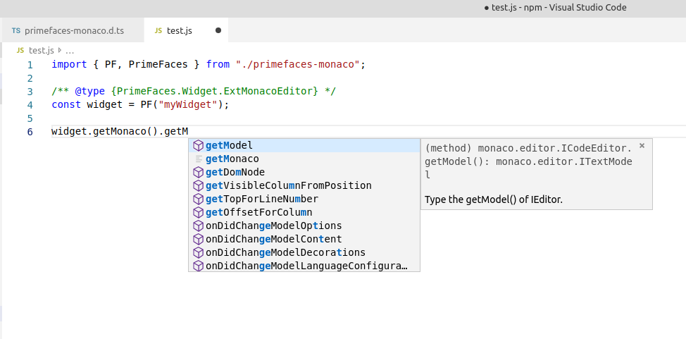

# primefaces-monaco

The [Monaco code editor](https://microsoft.github.io/monaco-editor/) lets you do awesome
code editing with intelligent suggestions-- check it out.

This is wrapper for the monaco editor to use it as a JSF component.

Requires [Primefaces](https://www.primefaces.org/) (>=8.0, use version 0.20 for PF 7 support).

Supports internationalization, ie. displaying the editor user interface in different languages.

# Documentation

* The tag documentation [is available here](https://blutorange.github.io/primefaces-monaco/vdldoc/index.html).
* The client-side API documentation [is available here](https://blutorange.github.io/primefaces-monaco/typedoc/index.html).

# Type definitions

There are typescript type definitions available for the client-side widget, see [src/npm/primefaces-monaco.d.ts](src/npm/src/primefaces-monaco.d.ts).

These depend on the types for `jquery` and `monaco-editor`:

```sh
npm install --save-dev monaco-editor @types/jquery
```

Now you can enjoy auto-completion:



# Usage

Make sure you're running at least PrimeFaces 7.0. Include this as a dependency:

```xml
<?xml version="1.0" encoding="UTF-8"?>
<project xmlns="http://maven.apache.org/POM/4.0.0"
         xmlns:xsi="http://www.w3.org/2001/XMLSchema-instance"
         xsi:schemaLocation="http://maven.apache.org/POM/4.0.0 http://maven.apache.org/xsd/maven-4.0.0.xsd">
    <modelVersion>4.0.0</modelVersion>

    ...

    <dependencies>
        <dependency>
            <groupId>com.github.blutorange</groupId>
            <artifactId>primefaces.monaco</artifactId>
            <version>0.22.0</version>
        </dependency>
    </dependencies>

</project>
```

Create a simple backing bean:

```java
import com.github.blutorange.primefaces.config.monacoeditor.*;

import javax.annotation.PostConstruct;
import javax.faces.bean.ManagedBean;
import javax.faces.bean.ViewScoped;
import java.io.Serializable;
import java.util.Arrays;
import java.util.Collection;

@ManagedBean(name="testBean")
@ViewScoped
public class TestBean implements Serializable {
    private String code;
    private String uiLanguage;
    private EditorOptions editorOptions;

    @PostConstruct
    private void init() {
        uiLanguage = "en";
        code = "/**\n" + " * @param {number} x The first number.\n" + " * @param {number} y The second number.\n" + " * @return {number} The sum of the numbers\n" + " */\n" + "function testbar(x, y) {\n" + "\treturn x + y;\n" + "}\n" + "const z1 = testbar(5, 3);\n" + "const z2 = testbar(5, 3);\n" + "const z3 = testbar(5, 3);";
        editorOptions = new EditorOptions()
                .setLanguage(ELanguage.JAVASCRIPT)
                .setTheme(ETheme.HC_BLACK)
                .setLineNumbers(ELineNumbers.INTERVAL)
                .setFontSize(20);
    }

    public String getUiLanguage() {
        return uiLanguage;
    }

    public void setUiLanguage(String uiLanguage) {
        this.uiLanguage = uiLanguage;
    }

    public Collection<String> getAvailableLanguages() {
        return Arrays.asList("bg", "de", "en", "es", "fr", "hu", "it", "ja", "ko", "ps", "pt-br", "ru", "tr", "uk", "zh-hans", "zh-hant");
    }

    public String getCodeLanguage() {
        return editorOptions.getLanguage();
    }

    public void setCodeLanguage(final String codeLanguage) {
        editorOptions.setLanguage(codeLanguage);
    }

    public String getCode() {
        return code;
    }

    public void setCode(final String code) {
        this.code = code;
    }

    public EditorOptions getEditorOptions() {
        return editorOptions;
    }

    public void setEditorOptions(EditorOptions editorOptions) {
        this.editorOptions = editorOptions;
    }
}
```

Finally create a simple `xhtml` page and include the editor as a tag:

```xhtml
<?xml version="1.0" encoding="UTF-8"?>
<!DOCTYPE html PUBLIC "-//W3C//DTD XHTML 1.0 Transitional//EN"
        "http://www.w3.org/TR/xhtml1/DTD/xhtml1-transitional.dtd">
<html xmlns="http://www.w3.org/1999/xhtml"
      xmlns:p="http://primefaces.org/ui"
      xmlns:blut="http://github.com/blutorange"
      xmlns:h="http://xmlns.jcp.org/jsf/html"
      xmlns:f="http://xmlns.jcp.org/jsf/core"
      xmlns:xsi="http://www.w3.org/2001/XMLSchema-instance"
      xsi:schemaLocation="http://xmlns.jcp.org/jsf/core http://xmlns.jcp.org/jsf/core http://primefaces.org/ui/extensions ">

<h:head>
    <title>Demo Application</title>
</h:head>

<h:body>
    <h3>Example</h3>
    <h:form id="form">
        <!-- Update with current options -->
        <p:commandButton value="Update" update="@form" process="@this,@form" partialSubmit="false"/>
        <!-- Available UI languages -->
        <p:selectOneMenu value="#{testBean.uiLanguage}">
            <f:selectItems var="item" value="#{testBean.availableLanguages}"/>
        </p:selectOneMenu>
        <!-- Select code language -->
        <p:inputText value="#{testBean.codeLanguage}"></p:inputText>
        <!-- Include the monaco editor -->
        <blut:monacoEditor widgetVar="monaco" id="monaco" value="#{testBean.code}" width="90vw" height="80vh"
                         editorOptions="#{testBean.editorOptions}"
                         uiLanguage="#{testBean.uiLanguage}"/>
    </h:form>
</h:body>
</html>
```

# Framed editor

Since version `0.19`, an additional PrimeFaces widget is available: `<blut:monacoEditorFramed />`. This loads the monaco
editor in an iframe for improved encapsulation. For example, the additional libraries you can add to the editor are
all window global. When you add two or more editors to the same page, this the additional libraries are shared by the
two editors, which may not always be desirable. Encapsulating each editor in an iframe solves this issue. Please note,
however, that a web worker needs to be created for each editor iframe. This may lead to slowdowns when there are many
editors.

Usage is the same as the normal editor, all options are the same. The `extender` option is minimally different, you need
to specifiy an URL to an extender script, as the extender needs to be loaded into the iframe - see the tag documentation
for more details.

```xhtml
        <blut:monacoEditorFramed widgetVar="monaco" id="monaco" value="#{testBean.code}"
            width="90vw" height="80vh"
            editorOptions="#{testBean.editorOptions}"
            uiLanguage="#{testBean.uiLanguage}"
            extender="extender.js.xhtml">
		</blut:monacoEditorFramed>
```

# Resize

If the container of the editor was resized, you can use [layout](https://microsoft.github.io/monaco-editor/api/interfaces/monaco.editor.istandalonecodeeditor.html#layout) to
resize the editor, eg.:

```javascript
PF("widgetVarOfEditor").getMonaco().layout();
```

There is also an `autoResize` option. If you set it to `true`, it will listen to any size changes of the container
element and call layout automatically. Please note that listening to size changes is a new technology and not
[yet supported by many browsers](https://caniuse.com/#feat=resizeobserver).

# Extender (Customizing via JavaScript)

Use the `extender` options to customize the monaco editor via JavaScript. For example, to add some additional
typescript definitions files, first create a JavaScript file with an extender factory:

```javascript
// Create an extender that loads the the given typescript definition files into the editor
function createExtender(...typescriptDefinitionFiles) {
    return {
        beforeCreate(widget, options, wasLibLoaded) {
            // Since the configuration is global, we must add the typescript definitions files only
            // if the library was loaded or reloaded.
            if (!wasLibLoaded) return;

            // Load all typescript definitions files from the network
            const fetched = typescriptDefinitionFiles.map(file =>
                fetch(file)
                    .then(response => response.text())
                    .then(text => ({text, file}))
            );
            // Loop over all loaded definition files and add them to the editor.
            return Promise.all(fetched)
                .then(defs => defs.forEach(def => {
                    monaco.languages.typescript.javascriptDefaults.addExtraLib(def.text, def.file)
                }))
                .then(() => options);
        },
    };
}

// Creates an extender with some basic typescript definitions files
function createExtenderBasic() {
    return createExtender(
        "https://raw.githubusercontent.com/DefinitelyTyped/DefinitelyTyped/master/types/sizzle/index.d.ts",
        "https://raw.githubusercontent.com/DefinitelyTyped/DefinitelyTyped/master/types/jquery/JQuery.d.ts",
        "https://raw.githubusercontent.com/DefinitelyTyped/DefinitelyTyped/master/types/jquery/JQueryStatic.d.ts",
        "https://raw.githubusercontent.com/DefinitelyTyped/DefinitelyTyped/master/types/jquery/misc.d.ts",
        "https://raw.githubusercontent.com/DefinitelyTyped/DefinitelyTyped/master/types/jquery/legacy.d.ts",
        "https://raw.githubusercontent.com/DefinitelyTyped/DefinitelyTyped/master/types/jqueryui/index.d.ts"
    );
}
```

The above code loads the definitions files from the [DefinitelyTyped](https://github.com/DefinitelyTyped/DefinitelyTyped/)
repository. Now just specify the `extender` option on the editor component:

```xhtml
<?xml version="1.0" encoding="UTF-8"?>
<!DOCTYPE html PUBLIC "-//W3C//DTD XHTML 1.0 Transitional//EN"
        "http://www.w3.org/TR/xhtml1/DTD/xhtml1-transitional.dtd">
<html xmlns="http://www.w3.org/1999/xhtml"
      xmlns:blut="http://github.com/blutorange"
      xmlns:xsi="http://www.w3.org/2001/XMLSchema-instance"
      xsi:schemaLocation="http://xmlns.jcp.org/jsf/core http://xmlns.jcp.org/jsf/core http://primefaces.org/ui/extensions ">

      <!-- ... -->

        <blut:monacoEditor value="#{...}" extender="createExtenderBasic()"/>
</html>
```

# Javascript API

See the [official API docs for the Monaco Editor](https://microsoft.github.io/monaco-editor/api/index.html).

You can access the monaco editor instance via the widget method `PrimeFaces.widget.ExtMonacoEditor.prototype.getMonaco`.
This method returns an instance of [IStandaloneCodeEditor](https://microsoft.github.io/monaco-editor/api/interfaces/monaco.editor.istandalonecodeeditor.html).

For example, when the widget variable `editor`:

```xhtml
<blut:monacoEditor id="monaco" value="#{...}" widgetVar="editor"/>
```

You can interact with the monaco editor like this via JavaScript:

```javascript
const standaloneCodeEditor = PF("editor").getMonaco();
standaloneCodeEditor.getModel().setValue("console.log('foobar');");
standaloneCodeEditor.focus();
```

There are a few more widget methods available, see the [JSDocs on the type definitions
for further details](https://github.com/blutorange/primefaces-monaco/blob/master/src/npm/primefaces-monaco.d.ts#L225).

# Events

Most events are forwarded from the Monaco Editor Javascript API so that they are available to JSF.

| Event        | Description                                                             | Reference |
| ------------ | ----------------------------------------------------------------------- |---------- |
| initialized  | Once the editor was loaded, initalized and is ready to be used.         | -         |
| change       | When the text content of the editor window changed.                     | [ondidchangemodelcontent](https://microsoft.github.io/monaco-editor/api/interfaces/monaco.editor.istandalonecodeeditor.html#ondidchangemodelcontent) |
| paste        | When text was pasted into the editor window.                            | -         |
| focus        | When the editor window or the editor UI gains focus.                    | [ondidfocuseditorwidget](https://microsoft.github.io/monaco-editor/api/interfaces/monaco.editor.istandalonecodeeditor.html#ondidfocuseditorwidget) |
| blur         | When the editor window or the editor UI loses focus.                    | [ondidblureditorwidget](https://microsoft.github.io/monaco-editor/api/interfaces/monaco.editor.istandalonecodeeditor.html#ondidblureditorwidget) |
| mousedown    | When a mouse button is pressed down while the mouse is over the editor. | [onmousedown](https://microsoft.github.io/monaco-editor/api/interfaces/monaco.editor.istandalonecodeeditor.html#onmousedown) |
| mouseup      | When a mouse button is released while the mouse is over the editor.     | [onmouseup](https://microsoft.github.io/monaco-editor/api/interfaces/monaco.editor.istandalonecodeeditor.html#onmouseup) |
| mousemove    | When the mouse is moved over the editor.                                | [onmousemove](https://microsoft.github.io/monaco-editor/api/interfaces/monaco.editor.istandalonecodeeditor.html#onmousemove) |
| keydown      | When the editor is focused and a keyboard button is pressed down.       | [onkeydown](https://microsoft.github.io/monaco-editor/api/interfaces/monaco.editor.istandalonecodeeditor.html#onkeydown) |
| keyup        | When the editor is focuesed and a keyboard button is released.          | [onkeyup](https://microsoft.github.io/monaco-editor/api/interfaces/monaco.editor.istandalonecodeeditor.html#onkeyup) |
| keypress     | When a character or passage of text was typed.                          | -         |

Example:

```xhtml
<blut:monacoEditor id="monaco" value="#{...}" >
    <pe:javascript event="change" execute="console.log('did change')"/>
</blut:monacoEditor>
```

If the widget variable of the component is `myWidget`, you can then retrieve the widget via `var widget = PF("myWidget")`. All events are also triggered
on the `widget.jq` element, prefixed with `monacoEditor:`. So you can also listen for event via JavaScript with `widget.jq.on("monacoEditor:initialized")`.

# Customizing

Part of the external API of monaco-editor and vscode is exposed to allow for deeper
customization of the editor. In addition to the usual `window.monaco` object, there
is also a `window.monacoExtras` object. It contains most symbols exported by the
source code files the [monaco-editor npm module](https://www.npmjs.com/package/monaco-editor).

> NOTE THAT AS IT IS AN INTERNAL API, IT MAY CHANGE AT ANY MOMENT WITHOUT NOTICE.
> USE AT YOUR OWN RISK

This will result in hacks, but may be the only options until an official API is
created. For example, if you need to customize the suggestions returned for the TypeScript
and JavaScript language, you could modify the [SuggestAdapter](https://github.com/Microsoft/monaco-typescript/blob/master/src/languageFeatures.ts):

```javascript
(function(){
    const tsOnly = new Set([
        monacoExtras.vs.language.typescript.LanguageFeatures.Kind.interface,
        monacoExtras.vs.language.typescript.LanguageFeatures.Kind.enum,
        monacoExtras.vs.language.typescript.LanguageFeatures.Kind.module,
        monacoExtras.vs.language.typescript.LanguageFeatures.Kind.type,
        monacoExtras.vs.language.typescript.LanguageFeatures.Kind.typeParameter,
    ]);
    const tsKeywords = new Set([
        "module", "namespace", "interface", "enum", "never", "any", "unknown", "void", "boolean", "number", "string", "object", "array"
    ]);
    monacoExtras.vs.language.typescript.LanguageFeatures.SuggestAdapter.prototype.provideCompletionItems = function(model, position, _context, token) {
        const triggeredByCtrlSpace = window.event && window.event instanceof KeyboardEvent && window.event.key === " ";
        const wordInfo = model.getWordUntilPosition(position);
        const resource = model.uri;
        const offset = this._positionToOffset(resource, position);
        const language = model.getLanguageIdentifier().language;
        return this._worker(resource).then(worker => {
            return worker.getCompletionsAtPosition(resource.toString(), offset);
        }).then(info => {
            if (!info) {
                return;
            }
            // Do not show top level suggestions unless the user requests them explicitly; or has typed at least some characters
            if (info.isGlobalCompletion && !triggeredByCtrlSpace && (wordInfo.endColumn - wordInfo.startColumn < 4)) {
                return false;
            }
            let incomplete = false;
            const suggestions = info.entries.filter(entry => {
                // Do not show typescript-only items
                if (language === "javascript") {
                    if (tsOnly.has(entry.kind) || (entry.kind === monacoExtras.vs.language.typescript.LanguageFeatures.Kind.keyword && tsKeywords.has(entry.name))) {
                        incomplete = true;
                        return false;
                    }
                }
                // Uncomment to hide top-level global variables
                /*
                if (info.isGlobalCompletion && entry.kind === monacoExtras.vs.language.typescript.LanguageFeatures.Kind.variable) {
                    return false;
                }
                */
                return true;
            }).map(entry => {
                return {
                    uri: resource,
                    position: position,
                    label: entry.name,
                    insertText: entry.name,
                    sortText: entry.sortText,
                    kind: monacoExtras.vs.language.typescript.LanguageFeatures.SuggestAdapter.convertKind(entry.kind)
                };
            });
            return {
                suggestions: suggestions,
                incomplete: incomplete,
            };
        });
    };
})();
```

The code snippet above hides some TypeScript-only suggestions and does not show as many top-level (window-scoped) suggestions.

# Building

```bash
git clone https://github.com/blutorange/primefaces-monaco
cd primefaces-monaco
mvn clean install
```

To create a dev build with JavaScript source maps:

```bash
mvn clean install -P dev
```

This will clone the [Microsoft/vscode-loc](Microsoft/vscode-loc) repository, download a local
installation of [node](https://nodejs.org) and [npm](http://npmjs.com/), generate some source
files and finally build the `jar`.

If you get an error with libssh2, try `apt-get install libssh2-dev libssl-dev gcc`.
See [nodegit/nodegit/issues/1134](https://github.com/nodegit/nodegit/issues/1134).

If you did not make any changes to the monaco editor JavaScript files, you can
speed up the build by skipping npm/webpack:

```bash
mvn install -P dev -Dskip.npm -Dskip.webpack
```

To build the `vdldoc`s, run:

```bash
mvn vdldoc:vdldoc
```

# Versioning

Major and semver number is the same as the monaco editor version. Patch version
is for this project.

# Release

* Check dependencies for updates:
    * `mvn versions:display-dependency-updates`
    * `cd src/npm ; npm outdated`
* Check for `TODO`s.
* Check `src/npm/descriptor/create.js` whether it reflects the current Monaco Editor API.
* Update version in `README.md` (installing)
* Update version in `src/main/java/com/github/blutorange/primefaces/util/Constants.java`
* Update version in `pom.xml`
* Update version in `demo/pom.xml`
* Update `CHANGELOG.md`.
* `mvn clean install`
* Use demo to test (see below)
* `mvn vdldoc:vdldoc`
* `mvn -P release deploy`

# Demo

There's a demo project with the editor under `/demo`. It contains several linked pages that
demonstrate one editor feature each. They also include a short description of what
is supposed to happen and thus can be used for integration testing as well.

To run it, first build the editor via `mvn clean install`,  then

```bash
cd demo
mvn package jetty:run
```

This starts a local application server with the demo project. Navigate to
[http://localhost:8094/monaco/test1.xhtml](http://localhost:8094/monaco/test1.xhtml).
